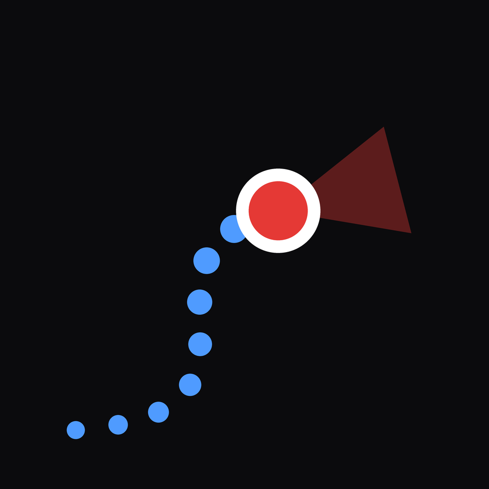

<p align="center">
  
</p>

<h1 align="center">GPSn't - not all those who wander are lost anymore</h1>

<p align="center">
  <a href="LICENSE"></a>
  <a href="https://github.com/HueyNemud/GPSnt/actions/workflows/ci.yml"></a>
  
</p>

GPSn't tracks your position where GPS can't.
No satellites, no network, no beacons: just motion sensors, a map, and your steps.

It tracks your steps and heading (*dead reckoning*) and corrects sensor drift using the walls on
the map (nobody walks through solid rock) and your manual cues: tap the map whenever you
recognize a landmark, and GPSn't learns from it.

> ⚠️ **Disclaimer**: GPSn't is only a fun experiment with dead reckoning and is not intended for
> real-world use. Never rely on it in emergencies, hazardous environments, or any situation where
> getting lost could put your safety at risk.

## Features

- **Works completely offline**: the map is built into the app.
- **Any map**: a scanned plan, a drawing, a survey… Bring an image, GPSn't does the rest.
- **Gets better as you walk**: each tap on the map teaches it your compass error and your real
  step length.
- **Map-aware**: positions that would go through walls are ruled out.
- **Robust heading**: phone held flat, tilted or upright; magnetic compass optional where metal
  disturbs it.
- **Dark and light map**, uncertainty circle, path, follow mode.

## Install

GPSn't runs on **Android** (7.0 or later, with a gyroscope).

1. Download the APK of the [latest release](https://github.com/HueyNemud/GPSnt/releases/latest).
   It contains a **demo map** to try the app. To use your own map,
   [build the app with it](#use-your-own-map).
2. Open the APK on the phone (from *Files* or *Downloads*). The first time, Android asks you to
   allow installing apps from that source: tap **Settings**, allow it, and come back.
3. Tap **Install**. If Play Protect warns about an unknown app, choose *Install anyway*.

## How to use

1. **Tap the map** at your starting position.
2. **Walk** holding the phone in front of you in portrait mode (screen facing you) or flat with
   the top pointing forward.
3. **Whenever you recognize a place, tap it** and confirm: your position is corrected and GPSn't
   learns from the drift. The more you do it, the better it gets.
4. **If *Compass poorly calibrated* appears**, wave your phone in a figure-8 motion.
5. **Near rails, pipes, or metal structures**, turn off *Settings → Magnetic compass*.

## Use your own map

You need a computer with Python, Node.js and the Android SDK (see the
[developer guide](docs/development.md#prerequisites)). Then:

1. Create a folder `maps/my-map/` containing your map image and a `map.config.json` describing its
   scale, its orientation and how to recognize the walls.
2. Run `./build.sh --map maps/my-map`.
3. Install `dist/gpsnt-<version>-<map>.apk` on the phone.

**[Using your own map](docs/map-packs.md)** explains every step. Only redistribute an APK if
you are allowed to share the map it contains.

## How it works

The phone's orientation sensors give the direction you walk in, and the accelerometer detects
your steps and estimates their length. A **particle filter** keeps hundreds of hypotheses about
your position, your compass error and your stride. Hypotheses that walk through walls or
disagree with your taps are dropped. What you see is their consensus, with a circle showing how
uncertain it is.

**[Technical report](docs/technical-report.md)**: plain-language explanations alongside the
formal models, from quaternions to Bayesian filtering, with references.

## Developer mode

```bash
./build.sh --dev            # once: development APK with the native module and the map
cd app && npm run dev       # then: scan the QR code, the app reloads on every save
npm test                    # engine unit tests
npm run simulate && npm run replay -- gpsnt-simulated-walk.json   # try the engine at the desk
```

See the **[developer guide](docs/development.md)** for the repository layout, tests, sensor
recordings and troubleshooting.

## Contributing

GPSn't is a personal project, but bug reports, field feedback and pull requests are welcome
through [issues](https://github.com/HueyNemud/GPSnt/issues). For tracking problems, a sensor
recording (*Settings → Record sensors*) helps a lot: only share it if you may share the map and
positions it contains.

## Licence

GPSn't is free software, released under the **GNU Affero General Public License v3.0 or later**
([LICENSE](LICENSE)). You can use, study, modify and share it. If you distribute it, or let people
use a modified version over a network, you must share your source code under the same licence.

Maps are not covered by this licence: each map belongs to its authors. The demo map in
`maps/demo/` is public domain (CC0). GPSn't displays maps with [Leaflet](https://leafletjs.com)
(BSD-2-Clause).
