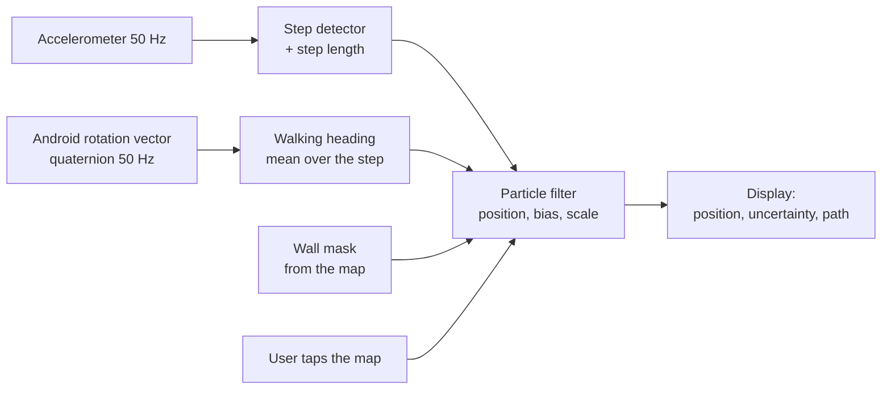

# How GPSn't works

*Technical report: pedestrian dead reckoning on a smartphone, constrained by a map*

GPSn't estimates where a person walks without any satellite, radio beacon or network: only
with the phone's motion sensors, a map image, and occasional hints from the user. This report
explains how. Each section opens with a plain-language summary (in a quote block) and then
gives the formal model, with references to the code that implements it.

**Contents**

1. [The problem](#1-the-problem)
2. [Sensors and reference frames](#2-sensors-and-reference-frames)
3. [Walking direction](#3-walking-direction)
4. [Step detection and step length](#4-step-detection-and-step-length)
5. [State-space model](#5-state-space-model)
6. [Particle filter](#6-particle-filter)
7. [Map constraints](#7-map-constraints)
8. [Manual fixes and parameter learning](#8-manual-fixes-and-parameter-learning)
9. [From the world to the map image](#9-from-the-world-to-the-map-image)
10. [Map packs](#10-map-packs)
11. [Error budget and limitations](#11-error-budget-and-limitations)
12. [Validation](#12-validation)
13. [References](#13-references)

---

## 1. The problem

> **In short.** Without GPS, the only way to know where you are is to count your steps and
> keep track of the direction you walk in, the way sailors did before satellites. This is
> called *dead reckoning*. The catch is that every small error adds up: after a few hundred
> metres, the estimate can be tens of metres off. GPSn't fights that drift with two extra
> sources of information: **the walls drawn on the map** (you cannot walk through rock) and
> **the user**, who can tap the map whenever they recognise a place.

Satellite positioning is unavailable underground, inside large buildings, in mines, quarries
and caves. In these environments, a smartphone still has an accelerometer, a gyroscope and a
magnetometer. *Pedestrian dead reckoning* (PDR) integrates these signals step by step
[[Harle 2013](#ref-harle)]:

$$
\mathbf{p}_k = \mathbf{p}_{k-1} + L_k \begin{pmatrix} \sin\theta_k \\ \cos\theta_k \end{pmatrix}
$$

where $\mathbf{p}_k$ is the horizontal position after step $k$ (East, North), $L_k$ the
step length and $\theta_k$ the walking heading. Errors in $L_k$ and $\theta_k$ are integrated
too, so the position error grows without bound. A constant heading error $\delta\theta$ alone
moves the walker sideways by $d \sin\delta\theta$ after a distance $d$: **1.7 m per 100 m and
per degree**.

GPSn't combines PDR with a map in a Bayesian filter: the estimate is a probability distribution
over positions (and over the sensor errors), represented by a cloud of *particles*. Hypotheses
that walk through walls lose credibility. Hypotheses that disagree with a position given by the
user are discarded. The filter learns the compass bias and the user's true step length along
the way.

The whole engine is plain TypeScript with no dependency on the phone
([`app/lib/nav/`](../app/lib/nav)): the app and the desktop replay tool run exactly the same
code.

## 2. Sensors and reference frames

> **In short.** Android already fuses the gyroscope, accelerometer and magnetometer into one
> clean "which way is the phone facing" signal. GPSn't uses it as is, instead of reinventing a
> compass, and only has to work out which way *the person* is walking from it.

GPSn't uses Android's `TYPE_ROTATION_VECTOR` virtual sensor
[[Android](#ref-android)], exposed by a small native module
([`RotationVectorModule.kt`](../app/modules/rotation-vector/android/src/main/java/expo/modules/rotationvector/RotationVectorModule.kt)).
It provides the attitude of the phone as a unit quaternion
$q = (w, x, y, z)$ mapping the **device frame** (x to the right of the screen, y to its top, z
out of the screen) to the **world frame** ENU (x East, y magnetic North, z Up):

$$
\mathbf{v}_{\text{world}} = q \, \mathbf{v}_{\text{device}} \, q^{*}
= R(q)\, \mathbf{v}_{\text{device}}
$$

with the usual rotation matrix

$$
R(q) = \begin{pmatrix}
1 - 2(y^2 + z^2) & 2(xy - wz) & 2(xz + wy) \\
2(xy + wz) & 1 - 2(x^2 + z^2) & 2(yz - wx) \\
2(xz - wy) & 2(yz + wx) & 1 - 2(x^2 + y^2)
\end{pmatrix}.
$$

When the user turns the magnetic compass off (useful near rails, pipes or reinforced concrete),
the module switches to `TYPE_GAME_ROTATION_VECTOR`, the same fusion without the magnetometer.
The heading then becomes relative: it is no longer disturbed by magnetic anomalies but it
drifts slowly with the gyroscope bias. The particle filter treats both cases alike, because
it estimates a heading bias anyway (section 5).

Headings $\theta$ are measured in radians, clockwise from North (0 = North, $\pi/2$ = East).

## 3. Walking direction

> **In short.** People hold their phone in many ways: flat, tilted, almost upright. GPSn't
> looks at where the top edge of the screen points, flattened onto the ground. When the phone
> is held nearly vertical that gets unreliable, so it smoothly switches to "perpendicular to
> the screen's left-right edge" instead. Then it averages the direction over each step,
> because the arm swings while walking.

The phone is assumed to be held in front of the user, in portrait, screen facing them. Let
$\mathbf{y}_w = R(q)\,\mathbf{e}_y$ and $\mathbf{x}_w = R(q)\,\mathbf{e}_x$ be the screen's top
and right axes expressed in the world frame, and $\mathbf{a}^{h}$ the horizontal part (East,
North) of a vector $\mathbf{a}$.

* **Main estimate.** The walking direction is the horizontal projection of the top axis,
  $\mathbf{f}_1 = \mathbf{y}_w^{h} / \lVert \mathbf{y}_w^{h} \rVert$. It is exact for any roll of
  the wrist about the y axis. Its norm $c = \lVert \mathbf{y}_w^{h} \rVert$ equals the cosine of
  the tilt of the phone, so it vanishes when the phone is held upright: $\mathbf{f}_1$ becomes
  undefined.
* **Fallback.** The right axis then remains horizontal and perpendicular to the walk, so
  forward is $`\mathbf{f}_2 = (\mathbf{e}_z \times \mathbf{x}_w)^{h} / \lVert \cdot \rVert = (-x_{w,N},\ x_{w,E}) / \lVert \cdot \rVert`$.
* **Blend.** With $\omega = \mathrm{clamp}\big((c - 0.17)/0.17,\ 0,\ 1\big)$, the walking
  direction is $\mathbf{f} = \omega\,\mathbf{f}_1 + (1-\omega)\,\mathbf{f}_2$. The weight goes from
  1 to 0 between about 70° and 80° of tilt ($\cos 70° \approx 0.34$, $\cos 80° \approx 0.17$).
  Unlike Euler angles, this has no singularity and no jump (unit-tested from −30° to 100°).

The heading of a step is the **circular mean** of $\mathbf{f}$ over all orientation samples since
the previous step: $\theta_k = \mathrm{atan2}\big(\sum f_E,\ \sum f_N\big)$. This removes
most of the periodic swing of the arm and avoids the 359°/1° wrap-around problem of an
arithmetic mean ([`orientation.ts`](../app/lib/nav/orientation.ts)).

## 4. Step detection and step length

> **In short.** Each step makes the phone bounce up and down. GPSn't smooths the acceleration
> signal, then counts one step for each clear bump (a peak followed by a dip). Bigger bumps
> mean longer strides: an empirical rule from the literature turns the size of the bump into
> a step length.

### 4.1 Detection

The accelerometer is sampled at 50 Hz. Its norm is independent of how the phone is held:

$$
m(t) = \lVert \mathbf{a}(t) \rVert - 1\ g.
$$

$m$ is low-pass filtered by a second-order Butterworth filter with cut-off $f_c = 3$ Hz
(walking cadence is 1.5–2.5 Hz). The filter is a biquad obtained by the bilinear transform
[[Bristow-Johnson](#ref-rbj)], with $K = \tan(\pi f_c / f_s)$ and $Q = 1/\sqrt{2}$:

$$
b_0 = b_2 = \frac{K^2}{1 + K/Q + K^2},\quad b_1 = 2 b_0,\quad
a_1 = \frac{2(K^2 - 1)}{1 + K/Q + K^2},\quad a_2 = \frac{1 - K/Q + K^2}{1 + K/Q + K^2}.
$$

The sampling rate $f_s$ is estimated online from the sensor timestamps, and the filter state is
initialised at steady state to avoid a spurious step at launch.

A small state machine then alternates between *looking for a peak* and *looking for a valley*,
with a hysteresis of 0.03 g to confirm each extremum. A step is accepted at the time of its peak
when:

| condition | value |
|---|---|
| peak height above 1 g | ≥ 0.04 g |
| peak-to-valley amplitude $A = m_{\max} - m_{\min}$ | ≥ 0.12 g |
| time since the previous step | ≥ 0.25 s |

### 4.2 Step length

The length uses Weinberg's model [[Weinberg 2002](#ref-weinberg)], which relates the stride to
the amplitude of the vertical bounce:

$$
L = K \cdot \big(A \cdot g\big)^{1/4}, \qquad L \in [0.3,\ 1.2]\ \text{m},
$$

with $A\,g$ in m/s² and $K = 0.5$ by default. Weinberg's original model uses the vertical
acceleration of a body-mounted sensor; GPSn't applies it to the filtered norm, which is
dominated by the vertical component when walking. $K$ depends on the person and on how the
phone is held. It can be set in the app, and the filter also learns a multiplicative
correction (section 5), so a rough $K$ is enough.

Implementation: [`step.ts`](../app/lib/nav/step.ts).

## 5. State-space model

> **In short.** Besides the position, GPSn't also tracks two unknowns: how wrong the compass
> is (bias) and how wrong the step length rule is for this person (scale). They are treated as
> unknowns to estimate, exactly like the position.

The hidden state after step $k$ is

$$
\mathbf{x}_k = \big(\mathbf{p}_k,\ b_k,\ s_k\big)
$$

with $\mathbf{p}_k$ the position in map pixels, $b_k$ the **heading bias** (compass error plus
error on the orientation of the map) and $s_k$ the **step scale** (true length / measured
length). Given the measured step $(L_k, \theta_k)$, the motion model is

$$
\begin{aligned}
b_k &= b_{k-1} + \eta_b, & \eta_b &\sim \mathcal{N}(0,\ (0.3°)^2) \\
s_k &= \max\big(0.5,\ s_{k-1} + \eta_s\big), & \eta_s &\sim \mathcal{N}(0,\ 0.003^2) \\
\ell_k &= \max\big(0,\ s_k L_k + \varepsilon_L\big), & \varepsilon_L &\sim \mathcal{N}(0,\ (0.05\ \text{m})^2) \\
\phi_k &= \theta_k + \delta + \nu + b_k + \varepsilon_\theta, & \varepsilon_\theta &\sim \mathcal{N}(0,\ (4°)^2) \\
\mathbf{p}_k &= \mathbf{p}_{k-1} + \ell_k\, \rho \begin{pmatrix} \sin\phi_k \\ -\cos\phi_k \end{pmatrix}
\end{aligned}
$$

where $\delta$ is the magnetic declination, $\nu$ the direction of north on the map and $\rho$ the
map scale in pixels per metre (section 9). The minus sign comes from the image y axis pointing
down. The random walks on $b$ and $s$ let the filter follow slow changes (gyroscope drift in
"no magnetometer" mode, a change of pace) and keep the particles diverse. At start, each
particle draws $b_0 \sim \mathcal{N}(0, (8°)^2)$ and $s_0 \sim \mathcal{N}(1, 0.1^2)$.

## 6. Particle filter

> **In short.** Instead of a single guess, GPSn't keeps 500 guesses ("particles"), each with
> its own position, compass bias and step scale. They all walk the same measured steps, each
> with a bit of random noise. Guesses that contradict what we know (a wall, a position given
> by the user) lose weight. Every now and then, the weak guesses are dropped and the strong ones
> duplicated. The displayed position is the weighted average of the cloud, and its spread
> gives the uncertainty circle.

The filter approximates the posterior $p(\mathbf{x}_k \mid \text{all measurements up to } k)$
by $N = 500$ weighted samples $\{\mathbf{x}_k^{(i)}, w_k^{(i)}\}$: this is the
*sequential importance resampling* (SIR, or bootstrap) filter
[[Gordon 1993](#ref-gordon), [Arulampalam 2002](#ref-arulampalam)].

1. **Prediction.** Each particle is propagated through the motion model of section 5 with its
   own noise draws.
2. **Update.** Each weight is multiplied by the likelihood of the available observations (map
   constraint at every step, section 7; user fix when there is one, section 8), then the weights
   are normalised to sum to 1.
3. **Resampling.** The *effective sample size* [[Kong 1994](#ref-kong)]
   $$N_{\text{eff}} = \Big(\sum_i \big(w^{(i)}\big)^2\Big)^{-1}$$
   measures weight degeneracy. When $N_{\text{eff}} < N/2$, particles are resampled with
   **systematic resampling** [[Kitagawa 1996](#ref-kitagawa), [Douc 2005](#ref-douc)]: a single
   uniform draw $u_0 \sim \mathcal{U}[0, 1/N)$, then particle $j$ is selected for each
   $u_i = u_0 + i/N$ such that $\sum_{l<j} w^{(l)} \le u_i < \sum_{l\le j} w^{(l)}$. This takes
   $O(N)$ time and has a lower variance than multinomial resampling. Weights are then reset to
   $1/N$.
4. **Estimate.** The displayed position, bias and scale are weighted means,
   $\hat{\mathbf{p}} = \sum_i w^{(i)} \mathbf{p}^{(i)}$, and the uncertainty radius is
   $\sigma = \sqrt{(\mathrm{Var}\,p_x + \mathrm{Var}\,p_y)/2}$. The bias is averaged
   arithmetically, which is valid because its spread stays small (a few degrees).

The pseudo-random generator is seeded (mulberry32, normals by the polar Box–Muller method):
replaying a recording always gives the same result
([`particleFilter.ts`](../app/lib/nav/particleFilter.ts), [`random.ts`](../app/lib/nav/random.ts)).

## 7. Map constraints

> **In short.** If a guess walks through a wall, it is almost certainly wrong: its weight is
> divided by a thousand. This is what corrects the drift for free. In a long corridor, the
> guesses whose compass bias is wrong soon hit a wall, so only those with the right bias
> survive: the filter learns the compass error without any help from the user. But a map can
> be wrong (a missing passage, a door): if *all* guesses hit a wall at once, GPSn't assumes the
> map is wrong at that spot and ignores the walls for that step.

### 7.1 Wall likelihood

The map pack provides a binary **wall mask** $M$ (one bit per map pixel, section 10). The
observation at each step is "the walker did not cross a wall". Its likelihood for a particle is

$$
p\big(\text{no crossing} \mid \mathbf{p}_{k-1}^{(i)}, \mathbf{p}_k^{(i)}\big) =
\begin{cases}
1 & \text{if the segment } [\mathbf{p}_{k-1}^{(i)}, \mathbf{p}_k^{(i)}] \text{ only crosses free pixels}\\
\varepsilon = 10^{-3} & \text{otherwise.}
\end{cases}
$$

A soft penalty $\varepsilon > 0$ rather than 0 keeps the filter alive when every particle is
penalised by a small map inaccuracy. Pixels outside the map count as walls.

The segment test walks the grid cells crossed by the segment with the Amanatides–Woo algorithm
[[Amanatides 1987](#ref-amanatides)], moving one cell along x *or* y at a time (4-connectivity).
A step therefore never "jumps" diagonally between two wall pixels that only touch by a corner.
The starting cell is not tested, so that a particle lying on a wall pixel (the map and the
estimate are not exact to the pixel) can leave it
([`wallMask.ts`](../app/lib/nav/wallMask.ts)).

### 7.2 Map conflicts

Let $W^- = \sum_i w^{(i)}$ before the wall update and $W^+$ after. If

$$
W^+ / W^- < 0.05,
$$

the map contradicts almost every hypothesis at once. This happens when the map misses a passage,
when the wall mask is too tight, or when the estimate is already badly off. In that case the
walls are **ignored for that step** and a *map conflict* is counted (shown in the details panel).
This is a simple robust-likelihood rule: an imperfect map must never trap the estimate.

### 7.3 Why walls estimate the compass bias

The bias $b$ is not observed directly: it only shows through the positions it produces. In a
corridor oriented along direction $\alpha$, a particle with bias $b^{(i)}$ walks along
$\alpha + (b^{(i)} - b_{\text{true}})$. It drifts sideways by roughly $d\,\sin(b^{(i)} - b_{\text{true}})$
and hits a wall after a distance of about $w / |b^{(i)} - b_{\text{true}}|$ for a corridor of
width $w$. Resampling then concentrates the cloud on biases close to $b_{\text{true}}$: the
constraint makes the bias *observable*. Turns help, because a bias error and a constant
lateral offset are indistinguishable along a single straight corridor. This idea of
map-matching with a particle filter is well established for indoor pedestrian navigation
[[Woodman 2008](#ref-woodman)].

## 8. Manual fixes and parameter learning

> **In short.** When you recognise a place, tap it. GPSn't keeps the guesses that ended up
> near that spot, and they are the ones whose compass bias and step scale were right. Then the
> whole cloud is moved to where you tapped. Each fix improves the estimate of the sensor
> errors, so the more fixes you make, the slower the drift becomes.

A fix is an observation $\mathbf{z}$ of the position with a Gaussian likelihood of standard
deviation $\sigma_z = 2$ m (converted to pixels):

$$
w^{(i)} \leftarrow w^{(i)} \exp\!\Big(-\frac{\lVert \mathbf{p}^{(i)} - \mathbf{z} \rVert^2}{2\sigma_z^2}\Big).
$$

The particles are then always resampled, and finally **re-centred**:
$\mathbf{p}^{(i)} \leftarrow \mathbf{p}^{(i)} + (\mathbf{z} - \hat{\mathbf{p}})$. This last step
is not Bayesian: it encodes the assumption that the user knows where they are better than
the filter does. Shifting the cloud as a whole keeps its shape and, above all, the diversity
of biases and scales that survived the weighting.

The parameters $(b, s)$ are learnt through this reweighting. Particles whose bias and scale led
them close to $\mathbf{z}$ are favoured, so the posterior over $(b, s)$ tightens fix after fix.
This is joint state and parameter estimation by state augmentation; the small random walks
on $b$ and $s$ play the role of the "artificial evolution" noise that prevents the parameter
particles from collapsing [[Liu & West 2001](#ref-liuwest)].

If no particle is within $3\sigma_z$ of the fix ($\max_i \exp(\cdot) < e^{-4.5}$), the error is
beyond what the model can explain (wrong start point, long magnetic disturbance…). The cloud
is then re-initialised around $\mathbf{z}$ with spread $\sigma_z/2$, keeping the learnt biases
and scales, and the user is told so.

## 9. From the world to the map image

> **In short.** The map is just an image, so GPSn't needs three numbers to relate it to the
> real world: its scale (pixels per metre), where north is on it, and the local magnetic
> declination (the angle between magnetic north and true north). All three come with the map
> and can be adjusted in the settings.

Positions are image pixels, origin at the top-left corner, y pointing down
([`mapFrame.ts`](../app/lib/nav/mapFrame.ts)). A magnetic heading $\theta$ becomes an image
direction (clockwise from the top of the image)

$$
\phi = \theta + \delta + \nu
$$

with $\delta$ the magnetic declination (true north → magnetic north, east positive; about
+1.5° in Paris in 2026, see [[NOAA](#ref-noaa)]) and $\nu$ the angle of true north on the map,
clockwise from the image top (0 for a north-up map). A step of length $\ell$ moves the position
by

$$
\Delta x = \ell\,\rho \sin\phi, \qquad \Delta y = -\ell\,\rho \cos\phi .
$$

Errors on $\delta$ and $\nu$ are constant heading offsets: they are absorbed by the bias $b$
(section 5). An error on $\rho$ is absorbed by the scale $s$.

## 10. Map packs

> **In short.** Before building the app, a small Python tool cuts the map into tiles (like
> online maps do) so that even a gigantic image displays smoothly, and extracts the walls from
> the map's colours into a very compact file.

The map kit ([`mapkit/`](../mapkit)) turns a map image and a configuration file into a *map
pack* embedded in the app (see [map-packs.md](map-packs.md) for the user guide).

**Tiles.** The image is cut into 256 px WebP tiles on zoom levels $z = 0 \dots Z$ with

$$
Z = \Big\lceil \log_2 \frac{\max(W, H)}{256} \Big\rceil ,
$$

level $Z$ being full resolution and each level below halving it. The app displays them with
Leaflet [[Leaflet](#ref-leaflet)] in a WebView, using a `CRS.Simple` whose transformation
$(x, y) \mapsto (x / 2^Z,\ y / 2^Z)$ makes one map unit equal to one image pixel at zoom $Z$.
Particles, position and path are therefore drawn directly in pixel coordinates. A light theme is
derived from a dark map (or the reverse) by inverting the HSL lightness while keeping hue and
saturation: $c' = 255 - \max(r,g,b) - \min(r,g,b) + c$ for each channel $c$.

**Wall extraction.** Two modes:

* *colors*: walkable areas are pixels matching user-defined colour rules (conjunctions of
  inequalities on $r, g, b$). The mask is dilated by 2 pixels to reconnect dashed lines; connected components smaller than `minSize` pixels across (letters, symbols) are
  dropped; the remainder is dilated by `margin` pixels (4-connected) as a tolerance. Everything
  else is a wall.
* *image*: a hand-drawn black-and-white image of the same size, dark pixels being walls.

**Encoding.** The mask is stored as run lengths of alternating free/wall pixels in row-major
order, each length written as an unsigned LEB128 varint, after a 12-byte header
(`GWM1`, width, height as little-endian u32). Real maps compress extremely well: the original
10 240 × 9 635 px field map (98.7 Mpx, i.e. 12.3 MB as a raw bitmap) takes 0.6 MB, and the
2 400 × 1 800 px demo map 21 kB.

## 11. Error budget and limitations

> **In short.** GPSn't does not make you un-lose-able. Its accuracy depends mostly on the
> compass, which metal underground can disturb, and on the quality of the map. Use it as an aid,
> always together with a paper map and the usual safety rules.

**Heading dominates.** A residual heading error $\delta\theta$ produces a lateral error
$d \sin \delta\theta$ that grows linearly with the distance walked: 1.7 m per 100 m per degree.
Walls and fixes bound it, but only where they carry information (turns, narrow passages). In wide
rooms or open areas, the estimate behaves like plain PDR.

**Magnetic disturbances.** Rails, pipes, cables and reinforced concrete bend the magnetic field
locally. The bias $b$ follows slow changes (random walk of 0.3° per step) but not sudden jumps
of tens of degrees. Disabling the magnetometer avoids the jumps at the cost of a slow gyroscope
drift.

**Phone pose.** The walking direction assumes the phone is held in front of the user, in portrait.
In a pocket or a bag, the heading is meaningless. Side-stepping and walking backwards are
not modelled.

**Step length.** Weinberg's rule is empirical. Stairs, slopes, crawling (cat-flaps, low galleries)
and irregular ground change the relation between bounce and stride. The scale $s$ absorbs
a constant error, not a terrain-dependent one.

**Map.** The constraint is only as good as the wall mask. A missing passage triggers map conflicts;
a passage drawn where there is none lets particles leak. The model is 2-D and single-level:
overlapping galleries on several levels are merged into one plane.

**Particle filter.** With 500 particles, the posterior is coarse. After a long time without
information, the cloud can collapse onto a wrong but wall-compatible branch (for instance a parallel
corridor). A fix restores it.

**Not a safety device.** GPSn't is experimental software, provided without warranty (see the
licence). It must never be the only means of orientation in a dangerous environment.

## 12. Validation

* **Unit tests** ([`nav.test.ts`](../app/lib/nav/nav.test.ts), [`test_mapkit.py`](../mapkit/tests/test_mapkit.py))
  cover the heading for every tilt and roll, the absence of jumps near vertical, the circular
  mean, step counting on synthetic gait signals, the wall-crossing test (including diagonal
  leaks), the mask encoding shared by Python and TypeScript, the learning of bias and scale from
  fixes, and the conflict rule.
* **End-to-end simulations** ([`simulate.ts`](../app/lib/nav/simulate.ts)) generate the raw
  sensor stream (quaternions and accelerations) of a walker following a path with a given
  compass bias, and feed it to the complete engine. On the demo map, along a 266 m path with
  7 turns and an 8° compass bias (`npm run simulate` then `npm run replay`):

  | information used | learnt bias | final uncertainty |
  |---|---|---|
  | walls only, no fix | 7.7° | ±2.7 m |
  | walls + a fix at each of the 8 waypoints | 8.0° | ±1.3 m |

  With neither walls nor fixes, the same 8° bias leaves the estimate about 33 m away from a 250 m straight
  corridor (unit test *end to end*).
* **Field recordings.** The app can record the raw sensor stream during a real walk, with the user's
  fixes as ground truth, and the replay tool (`npm run replay`) reruns the engine on it with other
  parameters: this is the way to tune them for a given phone, user and environment. A systematic field evaluation
  (several users, phones and environments) remains to be done.

## 13. References

**[Amanatides 1987]** J. Amanatides and A. Woo. *A fast voxel traversal algorithm for ray tracing.* Eurographics '87, 1987.

**[Android]** Android Open Source Project. *Position sensors* and *Sensor types: rotation vector, game rotation vector.* <https://source.android.com/docs/core/interaction/sensors/sensor-types>

**[Arulampalam 2002]** M. S. Arulampalam, S. Maskell, N. Gordon and T. Clapp. *A tutorial on particle filters for online nonlinear/non-Gaussian Bayesian tracking.* IEEE Transactions on Signal Processing, 50(2):174–188, 2002.

**[Bristow-Johnson]** R. Bristow-Johnson. *Cookbook formulae for audio EQ biquad filter coefficients.* <https://www.w3.org/TR/audio-eq-cookbook/>

**[Douc 2005]** R. Douc, O. Cappé and E. Moulines. *Comparison of resampling schemes for particle filtering.* Proc. 4th International Symposium on Image and Signal Processing and Analysis (ISPA), 2005.

**[Gordon 1993]** N. J. Gordon, D. J. Salmond and A. F. M. Smith. *Novel approach to nonlinear/non-Gaussian Bayesian state estimation.* IEE Proceedings F, 140(2):107–113, 1993.

**[Harle 2013]** R. Harle. *A survey of indoor inertial positioning systems for pedestrians.* IEEE Communications Surveys & Tutorials, 15(3):1281–1293, 2013.

**[Kitagawa 1996]** G. Kitagawa. *Monte Carlo filter and smoother for non-Gaussian nonlinear state space models.* Journal of Computational and Graphical Statistics, 5(1):1–25, 1996.

**[Kong 1994]** A. Kong, J. S. Liu and W. H. Wong. *Sequential imputations and Bayesian missing data problems.* Journal of the American Statistical Association, 89(425):278–288, 1994.

**[Leaflet]** V. Agafonkin et al. *Leaflet: an open-source JavaScript library for interactive maps.* <https://leafletjs.com>

**[Liu & West 2001]** J. Liu and M. West. *Combined parameter and state estimation in simulation-based filtering.* In A. Doucet, N. de Freitas and N. Gordon (eds.), *Sequential Monte Carlo Methods in Practice*, Springer, 2001.

**[NOAA]** NOAA National Centers for Environmental Information. *Magnetic field calculators.* <https://www.ngdc.noaa.gov/geomag/calculators/magcalc.shtml>

**[Weinberg 2002]** H. Weinberg. *Using the ADXL202 in pedometer and personal navigation applications.* Analog Devices Application Note AN-602, 2002.

**[Woodman 2008]** O. Woodman and R. Harle. *Pedestrian localisation for indoor environments.* Proc. 10th International Conference on Ubiquitous Computing (UbiComp), 2008.
